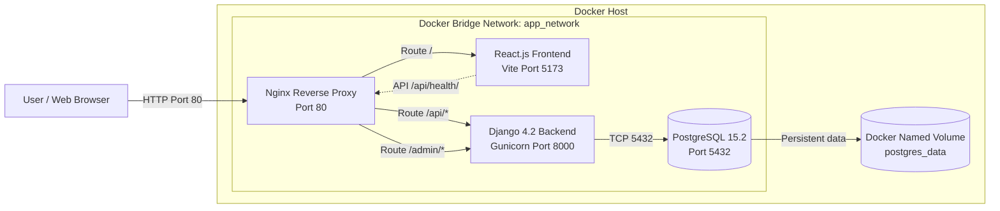

# Infrastructure Qualification Test

A multi-container web application environment featuring PostgreSQL 15.2, Django 4.2, React.js, Gunicorn, and Nginx.

## Technology Stack

- PostgreSQL 15.2
- Django 4.2 with Gunicorn
- React.js 18 with Vite
- Nginx reverse proxy
- Docker and Docker Compose

## System Architecture



Diagram source files are available in `docs/system-architecture.md` and `docs/system-architecture.mmd`.

## Architecture Explanation

- **Nginx** is the only service exposed to the host. It listens on port 80.
- Requests to `/` are routed to the React frontend.
- Requests to `/api/*` and `/admin/*` are routed to the Django backend.
- **Django** runs with Gunicorn on internal port 8000.
- **PostgreSQL** is reachable only through the Docker network on port 5432.
- PostgreSQL data persists in the `postgres_data` named volume.
- All services communicate through the `app_network` Docker bridge network.
- The demonstration does not require an external API. Future external integrations should be handled by Django.

## Request Flow

```text
Browser -> Nginx -> React
React -> Nginx -> Django -> PostgreSQL
```

## Project Structure

```text
project-root/
|-- backend/
|   |-- app/                 # Django health API
|   |-- config/              # Django project settings
|   |-- Dockerfile           # Backend container image
|   |-- entrypoint.sh        # Migration and Gunicorn startup
|   |-- manage.py
|   `-- requirements.txt
|-- frontend/
|   |-- src/                 # React components and styles
|   |-- Dockerfile           # Frontend container image
|   |-- index.html
|   `-- package.json
|-- nginx/
|   `-- nginx.conf           # Reverse proxy routing rules
|-- docs/
|   |-- system-architecture.md
|   `-- system-architecture.mmd
|-- .env.example             # Environment variable template
|-- .gitignore
|-- docker-compose.yml       # Multi-container orchestration
`-- README.md
```
## Prerequisites

- Git
- Docker Desktop
- Docker Compose

Verify the tools:

```bash
docker --version
docker compose version
git --version
```

Docker Desktop must be running before starting the environment.

## Build and Run

Clone the public repository:

```bash
git clone https://github.com/traisitvare/infrastructure-qualification-test.git
cd infrastructure-qualification-test
```

Create the local environment file.

Windows PowerShell:

```powershell
Copy-Item .env.example .env
```

Linux or macOS:

```bash
cp .env.example .env
```

Build and start all services:

```bash
docker compose up -d --build
```

## Verify the Environment

```bash
docker compose ps
```

Expected services:

```text
db          Up (healthy)
backend     Up
frontend    Up
nginx       Up
```

Application URLs:

- Frontend: `http://localhost/`
- Health API: `http://localhost/api/health/`
- Django Admin: `http://localhost/admin/`

Test the API using PowerShell:

```powershell
Invoke-RestMethod -Uri "http://localhost/api/health/"
```

Or curl:

```bash
curl http://localhost/api/health/
```

Expected response:

```json
{
  "status": "ok",
  "database": "connected"
}
```

## Logs

```bash
docker compose logs --tail=100
docker compose logs backend
docker compose logs frontend
docker compose logs nginx
docker compose logs db
```

Follow logs continuously:

```bash
docker compose logs -f
```

## Stop and Restart

Stop containers while retaining database data:

```bash
docker compose down
```

Restart:

```bash
docker compose up -d
```

Rebuild after code or dependency changes:

```bash
docker compose up -d --build
```

Reset the database and delete persistent data:

```bash
docker compose down -v
```

Warning: `docker compose down -v` permanently removes the PostgreSQL volume.

## Troubleshooting

### Port 80 is already in use

Check port 80 on Windows:

```powershell
Get-NetTCPConnection -LocalPort 80
```

Alternatively, change the Nginx mapping to `8080:80` and access `http://localhost:8080/`.

### Backend is restarting

```bash
docker compose logs backend --tail=100
```

### Nginx returns 502 Bad Gateway

```bash
docker compose ps
docker compose logs nginx --tail=100
docker compose logs backend --tail=100
```

### Database is unhealthy

```bash
docker compose logs db --tail=100
```

## Security and Design Considerations

- Only Nginx port 80 is published to the host.
- PostgreSQL, Django, and React ports remain internal.
- Secrets are supplied through a local `.env` file that is excluded from Git.
- Django runs with Gunicorn and a non-root container user.
- PostgreSQL uses a health check and persistent named volume.
- The backend waits for PostgreSQL to become healthy.
- Images and dependencies use explicit versions.
- Nginx forwards standard reverse-proxy headers.

## Author

Traisit Wareeratpakron  
IT Infrastructure Developer Qualification Test
## Dashboard Data Transparency

The frontend is an infrastructure verification dashboard, not a monitoring platform.

Live values are returned by `GET /api/health/`:

- Django API status
- PostgreSQL connection status
- Database name
- Database user
- PostgreSQL server version
- Database verification query duration
- Health-check timestamp
- Browser-to-API HTTP round-trip duration

The dashboard intentionally does not display simulated uptime percentages, CPU or memory charts, invented service latency, or static operational events. Container state should be verified using:

```bash
docker compose ps
```