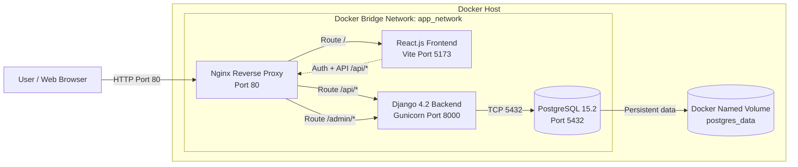

# System Architecture Diagram

## Data Flow

1. The browser connects to Nginx on host port 80.
2. Nginx routes / to React and /api/* or /admin/* to Django.
3. Django connects to PostgreSQL through the internal Docker bridge network.
4. PostgreSQL stores persistent data in the postgres_data named volume.
5. Django's authentication endpoints store registered users in PostgreSQL's `auth_user` table with hashed passwords.
6. No external API is required by this demonstration.
